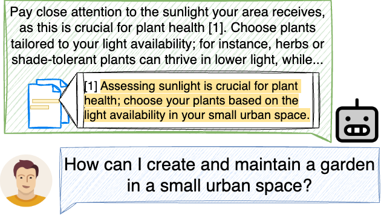

<div align="center">
  

# 🌇SUnsET🌇

### Unstructured Evidence Attribution for Long Context Query Focused Summarization

<!-- Authors and affiliations with improved formatting -->
Dustin Wright<sup>🎸</sup>, Zain Muhammad Mujahid<sup>🎸</sup>, Lu Wang<sup>🥁</sup>, Isabelle Augenstein<sup>🎸</sup>, and David Jurgens<sup>🥁</sup><br>

<sup>🎸</sup>University of Copenhagen
<br>
<sup>🥁</sup>University of Michigan
<br>
dw@di.ku.dk
<br>

[](https://arxiv.org/abs/2502.14409) &nbsp; [](https://huggingface.co/datasets/dwright37/SUnsET)

</div>

## Summaries with Unstructured Supporting Evidence

Large language models (LLMs) can generate good summaries from very long contexts given a user query. Citing evidence spans is useful for making these summaries more reliable and transparent, giving insight into the model's reasoning process and explaining the model's output. Previous work has focused on evidence citation with predefined levels of granularity (e.g. sentence, paragraph, document, etc.); here, we propose the task of long-context query focused summarization with *unstructured evidence citation*, i.e., no fixed levels of granularity. 

<div align="center">

</div>

[Our paper](https://arxiv.org/abs/2502.14409) shows how existing systems struggle to generate and properly cite unstructured evidence from their context, and that evidence tends to be "lost-in-the-middle". To help mitigate this, we created the **S**ummaries with **Uns**tructured **E**vidence **T**ext dataset (SUnsET), a synthetic dataset generated using a novel domain-agnostic pipeline which can be used as supervision to adapt LLMs to this task. We demonstrate across 5 LLMs of different sizes and 4 datasets with varying document types and lengths that LLMs adapted with SUnsET data generate more relevant and factually consistent evidence than their base models, extract evidence from more diverse locations in their context, and can generate more relevant and consistent summaries.

SUnsET is ideal to use as either a training set or an evaluation dataset for long context query focused summarization. It can additionally be used to evaluate and train models for evidence extraction and attribution.

## SUnsET Dataset

We have released our synthetic dataset, the Summaries with Unstructured Evidence Text (SUnsET) dataset, on Huggingface datasets. It can be downloaded as follows:

```
from datasets import load_dataset

dataset = load_dataset("dwright37/SUnsET")
```

The data contains the following columns:

```
doc_id: A unique document ID for each document
chunks: A list of strings containing each section of the document
question_text: A query about the document
response_referenced: The summary responding to the query with citations added to sentences
evidence: A list of strings containing the evidence used (in the same order as the reference numbers used in the summary)
response: The summary without any reference numbers added
unrefined_response: The original summary generated for the query before refining it
document: A string containing the concatenated document sections
```

## Code

We release the following scripts used to generate the results in our paper:

- `generate_synthetic_data.py`: Used to generate SUnsET
- `generate_synthetic_data_baseline.py`: Used to generate the baseline synthetic data for comparison
- `train.py`: Used for LoRA training
- `infer.py`: Used for all model inference
- `evaluate.py`: Used for all model evaluation

## Citation

If you find this work relevant and useful for your own, please consider citing us:

```
@misc{wright2025unstructuredevidenceattributionlong,
      title={{Unstructured Evidence Attribution for Long Context Query Focused Summarization}},
      author={Dustin Wright and Zain Muhammad Mujahid and Lu Wang and Isabelle Augenstein and David Jurgens},
      year={2025},
      eprint={2502.14409},
      archivePrefix={arXiv},
      primaryClass={cs.CL},
      url={https://arxiv.org/abs/2502.14409},
}
```
